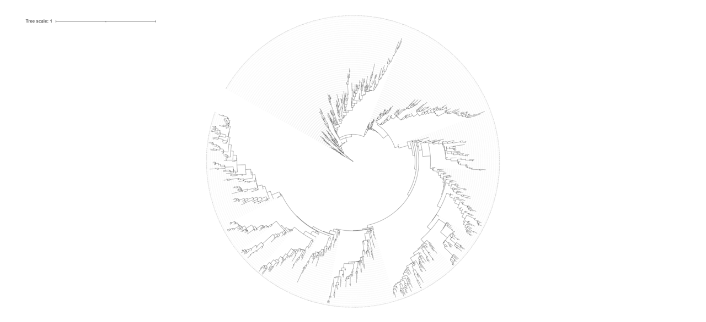
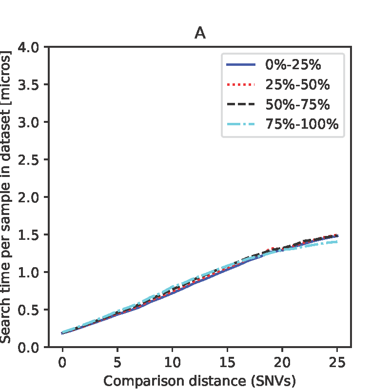
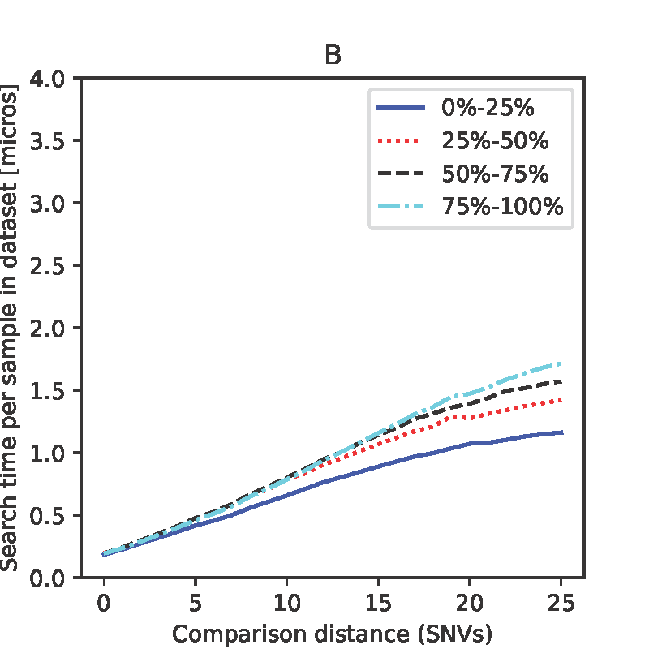

# Performance analysis using simulation

## Method
### Simulated data set analysed
To analyse the performance of Catwalk using simulated data, we used a 1,000 sample set derived by computational "evolution" from the Wuhan reference strain, under a coalecent model, using parameters derived from the observed evolution of SARS-CoV-2 in England.  SARS-CoV-2 mutates at a rate of about 2 SNV every 2 weeks, so most of the samples are within 25 SNV of the reference, given the duration of the simulation.The phylogenetic tree of the synthetic samples is as below.  The [synthetic data](sim0.fasta.gz) and [newick tree](truth0.nwk) are included.  

### Introduction of unknown bases
The synthetic sequences contain no unknown positions.

From each sequence, we generated four variants.  These contained 0 (i.e. no change), 5, 10 and 20% uncertain bases, at random across the genome.

### Performance testing
The 4,000 sequence file was loaded into CatWalk.  
A random sample of 1000 sequences were chosen, and the relationship between query time, and the  distance to root of the query (non-reference base numbers) and the number of uncertain bases in the query (in quantiles - each quantile corresponding to 0, 5, 10 and 20% uncertain bases) depicted.  [see Code](run_simulation.sh)

## Results
We plotted the mean search time per sample in the dataset, stratified by the number of Ns (0, 5, 10, 20%).
We observe that the search time increases approximately linearly with the SNV cutoff (the point at which the search algorithm decide the SNV distance is 'large' and so does not need to be reported).  Over the range simulated the number of unknown bases has little impact on search performance (corresponding to up to 20%, or about 6,000 of the sequence unknown) (see Panel A, quantiles refer to the number of uncertain bases in the query sequence).

By contrast, when stratifying by the distance from the reference, we observe that it takes longer to search for neighbours of samples further from the reference (see panel B; quantiles refer to the distance from the reference).

